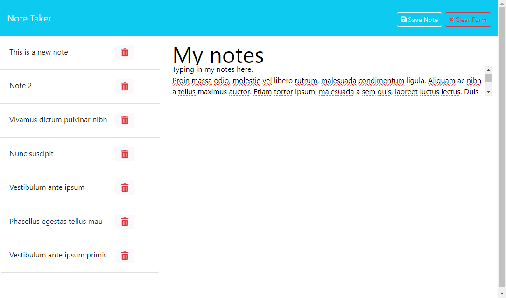
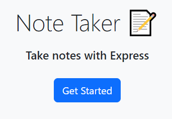

# Note Taker

## Description

This web application takes notes from the user and stores them in a file.
The code demonstrates the use of expressJS to serve HTTP requests and implement an API to manipualte backend data.

## Repository

[https://github.com/andrenrwn/notetaker](https://github.com/andrenrwn/notetaker)

## Installation

- nodeJS (if not yet installed)
- clone this repository
- npm install

## Usage

Local run:
$ node server.js

Express JS by default listens on port 3001, so browse to http://localhost:3001 or http://127.0.0.1:3001

- Click on "Get Started".
  This will take you to a page that lists all existing notes.
- Click on any note to show its contents on the right pane.
- Click on the "New Note" button to create a new note"
- After adding any text to the note body, a "Save Note" button will appear. Clicking it will save the note on permanent storage.
- Clicking on the red trash can wil delete the note from permanent storage.

## License

[MIT](LICENSE)

## Dependencies and Credits

- starter code including /public/_ and /helper/_ are credited to the UT Austin Coding Bootcamp
  [https://github.com/coding-boot-camp/miniature-eureka](https://github.com/coding-boot-camp/miniature-eureka)
- nanoid - unique IDs generated for notes. Requires ES6 module syntax. https://github.com/ai/nanoid#readme
- express JS - middleware framework for Javascript - https://expressjs.com/
